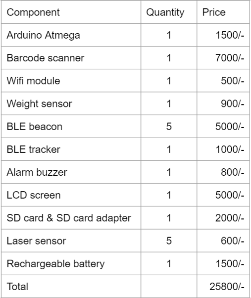

[comment]: # "This is the standard layout for the project, but you can clean this and use your own template"

# Project Title

---

## Team
-  E/17/159, Kavinaya Y, [e17159@eng.pdn.ac.lk](e17159@eng.pdn.ac.lk)
-  E/17/256, Piriyaraj S, [e17256@eng.pdn.ac.lk](e17256@eng.pdn.ac.lk)
-  E/17/292, Rilwan M.M.M, [e17292@eng.pdn.ac.lk](e17292@eng.pdn.ac.lk)

## Supervisors
1. Dr. Isuru Nawinne [[Website](http://www.ce.pdn.ac.lk/academic-staff/isuru-nawinne/), [Email](mailto:isurun@eng.pdn.ac.lk)]
2. Dr. Mahanama Wickramasinghe [[Website](http://www.ce.pdn.ac.lk/2021/05/02/dr-mahanama-wickramasinghe/), [Email](mailto:mahanamaw@eng.pdn.ac.lk)]

<!-- Image (photo/drawing of the final hardware) should be here -->

<!-- This is a sample image, to show how to add images to your page. To learn more options, please refer [this](https://projects.ce.pdn.ac.lk/docs/faq/how-to-add-an-image/) -->

<!--  -->

#### Table of Contents
1. [Introduction](#introduction)
2. [Solution Architecture](#solution-architecture )
3. [Hardware & Software Designs](#hardware-and-software-designs)
4. [Testing](#testing)
5. [Detailed budget](#detailed-budget)
6. [Conclusion](#conclusion)
7. [Links](#links)

## Introduction

Smart shopping cart can be described as a system that can simplify a shopping process in big stores or shopping centers by using 
a computerized shopping cart. it's aimed at enhancing the customer shopping experience by minimizing shopping time.

Main features of our our system :-

- Smart shopping cart will make the shopping experience more efficient for both customers and super market employees.
- Every product in the supermarket will have an barcode on it.
- Each cart will have an bar code reader.
- Our smart carts require customers to download the app to their personal smartphone.
- There will be a Centralized server system.
- LCD will show the improved bill at each instance the shopper increase or reduce commodity from the cart.
- Mobile app keeps adding the items in list and the total amount is updated accordingly.
- Automatic bill generating facility.
- Customers can do the bill payment through mobile application.
- Customers will be able to view their digital receipts via app.
- No human staff is needed for Billing purpose.
- Getting product information easy and and additional time not required.
- Alarm beeping functunality to prevent theft (for use in the case of non-payment for items in the cart)
- Customers can make their shopping lists before going to store using their mobile app and it will be reminding customers about missing items in their shopping list while they shop.
- Does not need any special training.
- It will increase the supermarket sales.

## Solution Architecture

High level diagram + description

## Hardware and Software Designs

Detailed designs with many sub-sections

## Testing

Testing done on hardware and software, detailed + summarized results

## Detailed budget

All items and costs

## Conclusion

What was achieved, future developments, commercialization plans

## Links

- [Project Repository](https://github.com/cepdnaclk/{{ page.repository-name }}){:target="_blank"}
- [Project Page](https://cepdnaclk.github.io/{{ page.repository-name}}){:target="_blank"}
- [Department of Computer Engineering](http://www.ce.pdn.ac.lk/)
- [University of Peradeniya](https://eng.pdn.ac.lk/)

[//]: # (Please refer this to learn more about Markdown syntax)
[//]: # (https://github.com/adam-p/markdown-here/wiki/Markdown-Cheatsheet)
